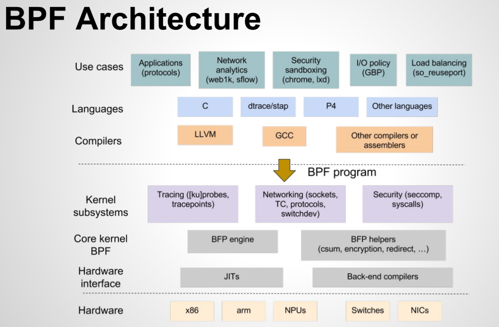

## eBPF和XDP学习-入门

#### 1.BPF和eBPF

###### 1.1 源起

BPF 的全称是 Berkeley Packet Filter，用于过滤(filter)网络报文(packet)的架构。BPF 的设计，最早可以追溯到 1992 年刊行在 USENIX conference 上的一篇论文：[The BSD Packet Filter: A New Architecture for User-level Packet Capture](http://www.tcpdump.org/papers/bpf-usenix93.pdf)。

自 linux内核3.17 ，全新设计的bpf被加入到 kernel/bpf 下。新BPF被命名为 extended BPF(eBPF)，传统的 BPF 被命名为 classical BPF(cBPF)。

###### 1.2 原理

The eBPF programs are triggered on events, such as disk I/O, TCP connections, and process creations. It is unlikely that the programs should cause the kernel to crash, loop or become unresponsive because they run in a safe virtual machine in the kernel.

eBPF是什么：

* An in-kernel virtual machine 

  *• Users can load its program and attach to a specific hook point in kernel*
  *• Safety guaranteed by BPF verifier*
  *• Attach points: network, trace point, driver, … etc*

* Maps

  *• Efficient key/value store resides in kernel space*
  *• Can be shared between eBPF prorgam and user space applications*

* Helper Functions

  *• A core kernel defined set of functions for eBPF program to retrieve/push data*  from/to the kernel

  

BPF的架构如下：

###### 1.3  eBPF的处理流程：

网卡传入的网络数据流从Kernel高速Path流向Userspace低速Path。eBPF主要处理在内核TC模块。

###### 1.4  用途

**Events**:

(1)  [ku]probes, tracepoints

(2)  networking(sockets, TC, switchdev)

(3)  security(seccomp, syscalls)

#### 2. XDP

 XDP (*eXpress Data Path*): Fast Programmable Packet Processing in the Operating System Kernel.  XDP provides bare metal packet processing at the lowest point in the software stack. Much of the huge speed gain comes from processing RX packet-pages directly out of drivers RX ring queue, before any allocations of meta-data structures like SKBs occurs.

图2-XDP原理

**注意：**
   ● XDP is designed for programmability. New functionality can
be implemented on the fly without needing kernel modification

* XDP is not kernel bypass. It is an integrated fast path in thekernel stack

*  XDP does not replace the TCP/IP stack. It augments the stack
  and works in concert

  

**XDP的使用场景：**

- Pre-stack processing like filtering to support DDoS mitigation
- Forwarding and load balancing
- Pre-stack filtering / processing
- Batching techniques such as in Generic Receive Offload
- Flow sampling, monitoring

###### 2.1 硬件要求

Using XDP is about specialization. Crafting a solution towards a very specialized purpose, that will require selecting and dimensioning the appropriate hardware. Using XDP requires understanding the dangers and pitfalls, that come from bypassing large parts of the kernel network stack code base, which is there for good reasons.

**XDP operation modes**

XDP has three operation modes where ‘native’ XDP is the default mode. When talked about XDP this mode is typically implied.

- **Native XDP**

  This is the default mode where the XDP BPF program is run directly out of the networking driver’s early receive path. Most widespread used NICs for 10G and higher support native XDP already.

- **Offloaded XDP**

  In the offloaded XDP mode the XDP BPF program is directly offloaded into the NIC instead of being executed on the host CPU. Thus, the already extremely low per-packet cost is pushed off the host CPU entirely and executed on the NIC, providing even higher performance than running in native XDP. This offload is typically implemented by SmartNICs containing multi-threaded, multicore flow processors where a in-kernel JIT compiler translates BPF into native instructions for the latter. Drivers supporting offloaded XDP usually also support native XDP for cases where some BPF helpers may not yet or only be available for the native mode.

- **Generic XDP**

  For drivers not implementing native or offloaded XDP yet, the kernel provides an option for generic XDP which does not require any driver changes since run at a much later point out of the networking stack. This setting is primarily targeted at developers who want to write and test programs against the kernel’s XDP API, and will not operate at the performance rate of the native or offloaded modes. For XDP usage in a production environment either the native or offloaded mode is better suited and the recommended way to run XDP.

**Driver support**

Since BPF and XDP is evolving quickly in terms of feature and driver support, the following lists native and offloaded XDP drivers as of kernel 4.17.

**Drivers supporting native XDP**

- Broadcom
  - bnxt

- Cavium
  - thunderx

- Intel
  - ixgbe
  - ixgbevf
  - i40e

- Mellanox
  - mlx4
  - mlx5

- Netronome
  - nfp

- Others
  - tun
  - virtio_net

- Qlogic
  - qede

- Solarflare
  - sfc [[1\]](http://docs.cilium.io/en/stable/bpf/#id4)

**Drivers supporting offloaded XDP**

- Netronome
  - nfp [[2\]](http://docs.cilium.io/en/stable/bpf/#id5)

Note that examples for writing and loading XDP programs are included in the toolchain section under the respective tools.

参考： [http://docs.cilium.io/en/stable/bpf/#hardening](http://docs.cilium.io/en/stable/bpf/#hardening)

###### 2.2  操作系统要求：

- redhat as 8 or ubuntu18.04(Linux 内核越新越好)

**The bpftrace language support has been added in RHEL 8**

Red Hat Enterprise Linux 8 supports the `bpftrace` language. `bpftrace` is a high-level tracing language for the `extended Berkeley Packet Filter (eBPF)` feature and is used for very specific tracing tasks while being easy to use. As a result, the user is able to achieve the same outcome with one line in `bpftrace` compared to a page of code that mixes Python and C in the `BPF Compiler Collection (BCC)` library.

**Notable changes in XDP and networking eBPF features in kernel**

The XDP and the networking eBPF features in the `kernel` package have been upgraded to upstream version 5.0, which provides a number of bug fixes and enhancements over the previous version:

- eBPF programs can now better interact with the TCP/IP stack, perform flow dissection, have wider range of `bpf` helpers available, and have access to new map types.
- XDP metadata are now available to AF_XDP sockets.

(BZ#1687459)

[https://access.redhat.com/documentation/en-us/red_hat_enterprise_linux/8-beta/html/8.1_release_notes/new-features#enhancement_installer-and-image-creation](https://access.redhat.com/documentation/en-us/red_hat_enterprise_linux/8-beta/html/8.1_release_notes/new-features#enhancement_installer-and-image-creation)

https://access.redhat.com/documentation/en-us/red_hat_enterprise_linux/8/html/managing_monitoring_and_updating_the_kernel/analyzing-system-performance-with-bpf-compiler_collection_managing-monitoring-and-updating-the-kernel)

###### 1.5  可能存在的问题和风险

XDP does not provide fairness. There is no buffering (qdisc) layer to absorb traffic bursts when the TX device is too slow, packets will simply be dropped. Don’t use XDP in situations where the RX device is faster than the TX device, as there is no back-pressure to save the packet from being dropped. There is no qdisc layer or BQL (Byte Queue Limit) to save you from introducing massive bufferbloat.

#### 3.主要参考

###### 3.1 linux内核代码

主要参考代码版本linux-4.14.148+

- src/samples/bpf
- src/net/bpf
- Documentation/networking/filter.txt

###### 3.2  资料参考

[eBPF 简史](https://www.ibm.com/developerworks/cn/linux/l-lo-eBPF-history/index.html)

[https://www.kernel.org/doc/Documentation/networking/filter.txt](https://www.kernel.org/doc/Documentation/networking/filter.txt)

[https://github.com/zoidbergwill/awesome-ebpf](https://github.com/zoidbergwill/awesome-ebpf)