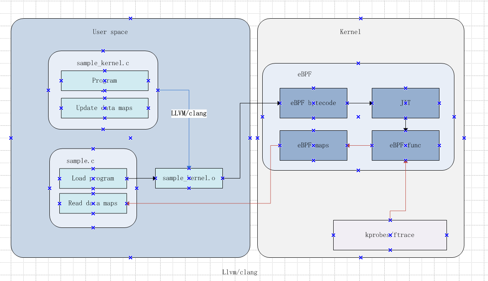
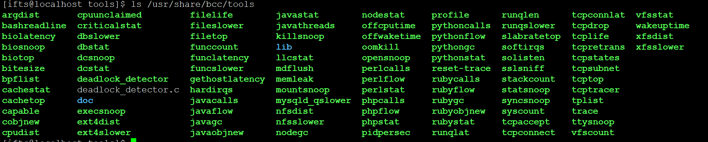

## eBPF和XDP学习-eBPF开发

#### 1. eBPF基础

###### 1.1 Instruction Set

(1) 10x 64bit registers
(2) 512B stack
(3) 1-8B load/store
(4) conditional jump
(5) arithmetic
(6) function call

```
 16 registers and 512 Byte stack: 
    * R0	- return value from in-kernel function, and exit value for eBPF program
    * R1 - R5	- arguments from eBPF program to in-kernel function
    * R6 - R9	- callee saved registers that in-kernel function will preserve
    * R10	- read-only frame pointer to access stack
```

```
Register value tracking
-----------------------
In order to determine the safety of an eBPF program, the verifier must 
the range of possible values in each register and also in each stack slot.
This is done with 'struct bpf_reg_state', defined in include/linux/
bpf_verifier.h, which unifies tracking of scalar and pointer values.  Each
register state has a type, which is either NOT_INIT (the register has not been
written to), SCALAR_VALUE (some value which is not usable as a pointer), or a
pointer type.  The types of pointers describe their base, as follows:
    PTR_TO_CTX          Pointer to bpf_context.
    CONST_PTR_TO_MAP    Pointer to struct bpf_map.  "Const" because arithmetic
                        on these pointers is forbidden.
    PTR_TO_MAP_VALUE    Pointer to the value stored in a map element.
    PTR_TO_MAP_VALUE_OR_NULL
                        Either a pointer to a map value, or NULL; map accesses
                        (see section 'eBPF maps', below) return this type,
                        which becomes a PTR_TO_MAP_VALUE when checked != NULL.
                        Arithmetic on these pointers is forbidden.
    PTR_TO_STACK        Frame pointer.
    PTR_TO_PACKET       skb->data.
    PTR_TO_PACKET_END   skb->data + headlen; arithmetic forbidden.
    PTR_TO_SOCKET       Pointer to struct bpf_sock_ops, implicitly refcounted.
    PTR_TO_SOCKET_OR_NULL
                        Either a pointer to a socket, or NULL; socket lookup
                        returns this type, which becomes a PTR_TO_SOCKET when
                        checked != NULL. PTR_TO_SOCKET is reference-counted,
                        so programs must release the reference through the
                        socket release function before the end of the program.
                        Arithmetic on these pointers is forbidden.
```


###### 1.2  Helper functions

Helper functions are a concept which enables BPF programs to consult a core kernel defined set of function calls in order to retrieve / push data from / to the kernel. Available helper functions may differ for each BPF program type, for example, BPF programs attached to sockets are only allowed to call into a subset of helpers compared to BPF programs attached to the tc layer.


(1)  forward/clone/drop packet
(2)  load/store packet data
(3)  load/store packet metadata
(4)  checksum (incremental)
(5)  push/pop vlan
(6)  access kernel mem (kprobes)


###### 1.3 Data structures

eBPF-map types:

```
* BPF_MAP_TYPE_HASH,
* BPF_MAP_TYPE_ARRAY,
* BPF_MAP_TYPE_PROG_ARRAY,
* BPF_MAP_TYPE_PERF_EVENT_ARRAY,
* BPF_MAP_TYPE_PERCPU_HASH,
* BPF_MAP_TYPE_PERCPU_ARRAY,
* BPF_MAP_TYPE_STACK_TRACE,
* BPF_MAP_TYPE_CGROUP_ARRAY,
* BPF_MAP_TYPE_LRU_HASH,
* BPF_MAP_TYPE_LRU_PERCPU_HASH,
* BPF_MAP_TYPE_LPM_TRIE,
```


XDP provides a set of predefined actions:

```
    * XDP_PASS: pass the packet to the normal network stack.
    * XDP_DROP: very fast drop.
    * XDP_TX: forward or TX-bounce back-out same interface.
    * XDP_REDIRECT: redirects the packet to another NIC or CPU.
    * XDP_ABORTED: indicates eBPF program error.
```


###### 1.4 eBPF maps

Using eBPF maps is a method to keep state between invocations of the eBPF program, and allows sharing data between eBPF kernel programs, and also between kernel and user-space applications.

Basically a key/value store with arbitrary structure (from man-page [bpf(2)](http://man7.org/linux/man-pages/man2/bpf.2.html)):

> eBPF maps are a generic data structure for storage of different data types. Data types are generally treated as binary blobs, so a user just specifies the size of the key and the size of the value at map-creation time. In other words, a key/value for a given map can have an arbitrary structure.


The map handles are file descriptors, and multiple maps can be created and accessed by multiple programs (from man-page [bpf(2)](http://man7.org/linux/man-pages/man2/bpf.2.html)):

> A user process can create multiple maps (with key/value-pairs being opaque bytes of data) and access them via file descriptors. Different eBPF programs can access the same maps in parallel. It’s up to the user process and eBPF program to decide what they store inside maps.


```
apis:

union bpf_attr {
               struct {    /* Used by BPF_MAP_CREATE */
                   __u32         map_type;
                   __u32         key_size;    /* size of key in bytes */
                   __u32         value_size;  /* size of value in bytes */
                   __u32         max_entries; /* maximum number of entries
                                                 in a map */
               };

               struct {    /* Used by BPF_MAP_*_ELEM and BPF_MAP_GET_NEXT_KEY
                              commands */
                   __u32         map_fd;
                   __aligned_u64 key;
                   union {
                       __aligned_u64 value;
                       __aligned_u64 next_key;
                   };
                   __u64         flags;
               };

               struct {    /* Used by BPF_PROG_LOAD */
                   __u32         prog_type;
                   __u32         insn_cnt;
                   __aligned_u64 insns;      /* 'const struct bpf_insn *' */
                   __aligned_u64 license;    /* 'const char *' */
                   __u32         log_level;  /* verbosity level of verifier */
                   __u32         log_size;   /* size of user buffer */
                   __aligned_u64 log_buf;    /* user supplied 'char *'
                                                buffer */
                   __u32         kern_version;
                                             /* checked when prog_type=kprobe
                                                (since Linux 4.1) */
               };
           } __attribute__((aligned(8)));


#include <linux/bpf.h>
int bpf(int cmd, union bpf_attr *attr, unsigned int size);

 The value provided in cmd is one of the following:
       BPF_MAP_CREATE
              Create a map and return a file descriptor that refers to the map.   The  close-on-exec  file  descriptor  flag  (see
              fcntl(2)) is automatically enabled for the new file descriptor.

       BPF_MAP_LOOKUP_ELEM
              Look up an element by key in a specified map and return its value.

       BPF_MAP_UPDATE_ELEM
              Create or update an element (key/value pair) in a specified map.

       BPF_MAP_DELETE_ELEM
              Look up and delete an element by key in a specified map.

       BPF_MAP_GET_NEXT_KEY
              Look up an element by key in a specified map and return the key of the next element.
       BPF_PROG_LOAD
              Verify  and  load  an  eBPF program, returning a new file descriptor associated with the program.  The close-on-exec
              file descriptor flag (see fcntl(2)) is automatically enabled for the new file descriptor.
             
```


###### 1.5 eBPF verifier

The safety of the eBPF program is determined in two steps.

First step does DAG(Directed Acyclic Graph) check to disallow loops and other CFG validation.
In particular it will detect programs that have unreachable instructions.
(though classic BPF checker allows them)

Second step starts from the first insn and descends all possible paths.
It simulates execution of every insn and observes the state change of
registers and stack.

Simulation of execution of all paths of the program

Steps involved (extract):

```
* Checking control flow graph for loops
* Detecting out of range jumps, unreachable instructions
* Tracking context access, initialized memory, stack spill/fills
* Checking unpriviledged pointer leaks
* Verifying helper function call arguments
* Value and alignment tracking for data access (pkt pointer, map access)
* Register liveness analysis for pruning
* State pruning for reducing verification complexity
* Patching BPF programs at post-verification
```

verifier会做两轮检查：

- 首轮检查(First pass，实现于check_cfg())可以被认为是一次深度优先搜索，主要目的是对注入代码进行一次 DAG(Directed Acyclic Graph，有向无环图)检测，以保证其中没有循环存在；除此之外，一旦在代码中发现以下特征，verifier 也会拒绝注入：
  - 代码长度超过上限，目前(内核版本 4.12)eBPF 的代码长度上限为 4K 条指令——这在 cBPF 时代很难达到，但别忘了 eBPF 代码是可以用 C 实现的；
  - 存在可能会跳出 eBPF 代码范围的 JMP，这主要是为了防止恶意代码故意让程序跑飞；
  - 存在永远无法运行(unreachable)的 eBPF 令，例如位于 exit 之后的指令；
- 次轮检查(Second pass，实现于[do_check()](http://elixir.free-electrons.com/linux/v4.12.6/source/kernel/bpf/verifier.c#L2896))较之于首轮则要细致很多：在本轮检测中注入代码的所有逻辑分支从头到尾都会被完全跑上一遍，所有的指令的参数（寄存器）、访问的内存、调用的函数都会被仔细的捋一遍，任何的错误都会导致注入程序被退货。由于过分细致，本轮检查对于注入程序的复杂度也有所限制：首先程序中的分支(branch)不允许超过 1024 个；其次经检测的指令数也必须在 96K 以内。


###### 1.6 Tail Calls  and BPF to BPF Calls


Another concept that can be used with BPF is called tail calls. Tail calls can be seen as a mechanism that allows one BPF program to call another, without returning back to the old program. Such a call has minimal overhead as unlike function calls, it is implemented as a long jump, reusing the same stack frame.


Aside from BPF helper calls and BPF tail calls, a more recent feature that has been added to the BPF core infrastructure is BPF to BPF calls. Before this feature was introduced into the kernel, a typical BPF C program had to declare any reusable code that.


###### 1.6 BPF JITs


JITs in kernel: x86 64, arm64, ppc64, mips64, s390x, sparc64, arm32

Full instruction set supported by all 64 bit JITs

BPF registers mapped to CPU registers 1:1

it can be enabled through:

```
# echo 1 > /proc/sys/net/core/bpf_jit_enable
```

BPF calling convention for helpers allows for efficient mapping
(1) R0 → return value from helper call
(2) R1 - R5 → argument registers for helper call
(3) R6 - R9 → callee saved, preserved on helper call


#### 2. 网络基础

###### 2.1 网卡收发包流程


以接收数据包为例，传输过程逐渐拆包，如图示：


一些结构体说明：

```
union macaddr {
	struct {
		__u32 p1;
		__u16 p2;
	};
	__u8 addr[6];
};
```


```
struct iphdr {
#if defined(__LITTLE_ENDIAN_BITFIELD)
	__u8	ihl:4,
		version:4;
#elif defined (__BIG_ENDIAN_BITFIELD)
	__u8	version:4,
  		ihl:4;
#else
#error	"Please fix <asm/byteorder.h>"
#endif
	__u8	tos;
	__be16	tot_len;
	__be16	id;
	__be16	frag_off;
	__u8	ttl;
	__u8	protocol;
	__sum16	check;
	__be32	saddr;
	__be32	daddr;
	/*The options start here. */
};
```

```
struct ipv6hdr {
#if defined(__LITTLE_ENDIAN_BITFIELD)
	__u8			priority:4,
				version:4;
#elif defined(__BIG_ENDIAN_BITFIELD)
	__u8			version:4,
				priority:4;
#else
#error	"Please fix <asm/byteorder.h>"
#endif
	__u8			flow_lbl[3];

	__be16			payload_len;
	__u8			nexthdr;
	__u8			hop_limit;

	struct	in6_addr	saddr;
	struct	in6_addr	daddr;
};
```


```
struct ethhdr {
	unsigned char	h_dest[ETH_ALEN];	/* destination eth addr	*/
	unsigned char	h_source[ETH_ALEN];	/* source ether addr	*/
	__be16		h_proto;		/* packet type ID field	*/
} __attribute__((packed));
```

```
struct tcphdr {
	__be16	source;
	__be16	dest;
	__be32	seq;
	__be32	ack_seq;
#if defined(__LITTLE_ENDIAN_BITFIELD)
	__u16	res1:4,
		doff:4,
		fin:1,
		syn:1,
		rst:1,
		psh:1,
		ack:1,
		urg:1,
		ece:1,
		cwr:1;
#elif defined(__BIG_ENDIAN_BITFIELD)
	__u16	doff:4,
		res1:4,
		cwr:1,
		ece:1,
		urg:1,
		ack:1,
		psh:1,
		rst:1,
		syn:1,
		fin:1;
#else
#error	"Adjust your <asm/byteorder.h> defines"
#endif	
	__be16	window;
	__sum16	check;
	__be16	urg_ptr;
};
```


```
struct udphdr {
	__be16	source;
	__be16	dest;
	__be16	len;
	__sum16	check;
};
```


###### 2.3  一些术语


- TSO: TCP segmentation offload 
- UFO: UDP fragmentation offload 
- GSO:generic segmentation offload
- GRO:generic receive offload ([GRO](http://vger.kernel.org/~davem/cgi-bin/blog.cgi/2010/08/30)) 

generic receive offload ([GRO](http://vger.kernel.org/~davem/cgi-bin/blog.cgi/2010/08/30)) allows the NIC driver to combine received packets into a single large packet which is then passed to the IP stack. When forwarding packets, GRO allows for the original packets to be reconstructed which is necessary to maintain the end-to-end nature of IP packets.

参考：[https://www.coverfire.com/articles/queueing-in-the-linux-network-stack/](https://www.coverfire.com/articles/queueing-in-the-linux-network-stack/)


#### 3. eBPF开发

###### 3.1 普通开发

 the process of using an eBPF program was summarized into three steps.

1. Creation of the eBPF program as byte code.

2. Loading the program into the kernel and creating necessary eBPF-maps.

3. Attaching the loaded program to a system.

   

steps:

C ==>  LLVM ==> BPF ==> loader ==> verifier ==> JIT ==>TC/XDP ==> offload


BPF has slightly different environment for C
(1)  Helper functions and program context available
(2)  Program entry points specified by sections
(3)  One or more entry points in a single object file possible
(4)  Library functions all get inlined, no notion of function calls (yet)
(5)  No global variables, no loops (yet) unless unrolled by pragma
(6)  No const strings or data structures
(7)  LLVM built-in functions usually available and inlined
(8)  Partitioning processing path with tail calls
(9)  Limited stack space up to 512 bytes

处理流程如下：





###### 3.2 使用BCC开发

BPF Compiler Collection (BCC) is a library, which facilitates the creation of the extended Berkeley Packet Filter (eBPF) programs. Their main utility is analyzing OS performance and network performance without experiencing overhead or security issues.

BCC removes the need for users to know deep technical details of eBPF, and provides many out-of-the-box starting points, such as the `bcc-tools` package with pre-created eBPF programs.

BCC makes BPF programs easier to write, with kernel instrumentation in C
(and includes a C wrapper around LLVM), and front-ends in Python and lua.
It is suited for many tasks, including performance analysis and network
traffic control.

处理流程如下：


For more information about BCC, see the `/usr/share/doc/bcc/README.md` file.


上述工具所在目录：/usr/share/bcc/tools





项目地址： https://github.com/iovisor/bcc


###### 3.3 使用P4开发

[p4c-xdp-lpc18-presentation.pdf](./p4c-xdp-lpc18-presentation.pdf)


#### 4.主要参考

###### 4.1  资料参考

[dive-into-bpf/](https://qmonnet.github.io/whirl-offload/2016/09/01/dive-into-bpf/)

[eBPF 简史](https://www.ibm.com/developerworks/cn/linux/l-lo-eBPF-history/index.html)

[https://www.kernel.org/doc/Documentation/networking/filter.txt](https://www.kernel.org/doc/Documentation/networking/filter.txt)

[https://github.com/zoidbergwill/awesome-ebpf](https://github.com/zoidbergwill/awesome-ebpf)

[https://netdevconf.info/2.2/session.html?viljoen-xdpoffload-talk](https://netdevconf.info/2.2/session.html?viljoen-xdpoffload-talk)

[https://prototype-kernel.readthedocs.io/en/latest/](https://prototype-kernel.readthedocs.io/en/latest/)

[网卡数据收发包过程](https://blog.csdn.net/hz5034/article/details/79794615)

[https://www.coverfire.com/articles/queueing-in-the-linux-network-stack/](https://www.coverfire.com/articles/queueing-in-the-linux-network-stack/)

https://prototype-kernel.readthedocs.io/en/latest/bpf/index.html

[http://vger.kernel.org/lpc_net2018_talks/XDP_meta-data_LPC_final_final.pdf](http://vger.kernel.org/lpc_net2018_talks/XDP_meta-data_LPC_final_final.pdf)

[http://people.netfilter.org/hawk/presentations/OpenSourceDays2017/XDP_DDoS_protecting_osd2017.pdf](http://people.netfilter.org/hawk/presentations/OpenSourceDays2017/XDP_DDoS_protecting_osd2017.pdf)


###### 3.3 开源项目参考

[linux](https://www.kernel.org/)

[https://github.com/dropbox/goebpf](https://github.com/dropbox/goebpf)

[https://github.com/cilium/cilium](https://github.com/cilium/cilium)

[https://github.com/genuinetools/bpfd](https://github.com/genuinetools/bpfd)

[https://github.com/iovisor/ply](https://github.com/iovisor/ply)

[https://qmonnet.github.io/whirl-offload/2016/09/01/dive-into-bpf/](https://qmonnet.github.io/whirl-offload/2016/09/01/dive-into-bpf/)

[https://github.com/iovisor/bcc](https://github.com/iovisor/bcc)

[https://github.com/cloudflare/ebpf_exporter](https://github.com/cloudflare/ebpf_exporter)

[https://github.com/facebookincubator/katran](https://github.com/facebookincubator/katran)

https://github.com/xdp-project/xdp-tutorial


###### **3.4 Projects using BPF**

The following list includes a selection of open source projects making use of BPF respectively provide tooling for BPF. In this context the eBPF instruction set is specifically meant instead of projects utilizing the legacy cBPF:

**Tracing**

- **BCC**

  BCC stands for BPF Compiler Collection and its key feature is to provide a set of easy to use and efficient kernel tracing utilities all based upon BPF programs hooking into kernel infrastructure based upon kprobes, kretprobes, tracepoints, uprobes, uretprobes as well as USDT probes. The collection provides close to hundred tools targeting different layers across the stack from applications, system libraries, to the various different kernel subsystems in order to analyze a system’s performance characteristics or problems. Additionally, BCC provides an API in order to be used as a library for other projects.

  https://github.com/iovisor/bcc

- **bpftrace**

  bpftrace is a DTrace-style dynamic tracing tool for Linux and uses LLVM as a back end to compile scripts to BPF-bytecode and makes use of BCC for interacting with the kernel’s BPF tracing infrastructure. It provides a higher-level language for implementing tracing scripts compared to native BCC.

  https://github.com/ajor/bpftrace

- **perf**

  The perf tool which is developed by the Linux kernel community as part of the kernel source tree provides a way to load tracing BPF programs through the conventional perf record subcommand where the aggregated data from BPF can be retrieved and post processed in perf.data for example through perf script and other means.

  https://git.kernel.org/pub/scm/linux/kernel/git/torvalds/linux.git/tree/tools/perf

- **ply**

  ply is a tracing tool that follows the ‘Little Language’ approach of yore, and compiles ply scripts into Linux BPF programs that are attached to kprobes and tracepoints in the kernel. The scripts have a C-like syntax, heavily inspired by DTrace and by extension awk. ply keeps dependencies to very minimum and only requires flex and bison at build time, only libc at runtime.

  https://github.com/wkz/ply

- **systemtap**

  systemtap is a scripting language and tool for extracting, filtering and summarizing data in order to diagnose and analyze performance or functional problems. It comes with a BPF back end called stapbpf which translates the script directly into BPF without the need of an additional compiler and injects the probe into the kernel. Thus, unlike stap’s kernel modules this does neither have external dependencies nor requires to load kernel modules.

  https://sourceware.org/git/gitweb.cgi?p=systemtap.git;a=summary

- **PCP**

  Performance Co-Pilot (PCP) is a system performance and analysis framework which is able to collect metrics through a variety of agents as well as analyze collected systems’ performance metrics in real-time or by using historical data. With pmdabcc, PCP has a BCC based performance metrics domain agent which extracts data from the kernel via BPF and BCC.

  https://github.com/performancecopilot/pcp

- **Weave Scope**

  Weave Scope is a cloud monitoring tool collecting data about processes, networking connections or other system data by making use of BPF in combination with kprobes. Weave Scope works on top of the gobpf library in order to load BPF ELF files into the kernel, and comes with a tcptracer-bpf tool which monitors connect, accept and close calls in order to trace TCP events.

  https://github.com/weaveworks/scope

**Networking**

- **Cilium**

  Cilium provides and transparently secures network connectivity and load-balancing between application workloads such as application containers or processes. Cilium operates at Layer 3/4 to provide traditional networking and security services as well as Layer 7 to protect and secure use of modern application protocols such as HTTP, gRPC and Kafka. It is integrated into orchestration frameworks such as Kubernetes and Mesos, and BPF is the foundational part of Cilium that operates in the kernel’s networking data path.

  https://github.com/cilium/cilium

- **Suricata**

  Suricata is a network IDS, IPS and NSM engine, and utilizes BPF as well as XDP in three different areas, that is, as BPF filter in order to process or bypass certain packets, as a BPF based load balancer in order to allow for programmable load balancing and for XDP to implement a bypass or dropping mechanism at high packet rates.

  http://suricata.readthedocs.io/en/latest/capture-hardware/ebpf-xdp.html

  https://github.com/OISF/suricata

- **systemd**

  systemd allows for IPv4/v6 accounting as well as implementing network access control for its systemd units based on BPF’s cgroup ingress and egress hooks. Accounting is based on packets / bytes, and ACLs can be specified as address prefixes for allow / deny rules. More information can be found at:

  http://0pointer.net/blog/ip-accounting-and-access-lists-with-systemd.html

  https://github.com/systemd/systemd

- **iproute2**

  iproute2 offers the ability to load BPF programs as LLVM generated ELF files into the kernel. iproute2 supports both, XDP BPF programs as well as tc BPF programs through a common BPF loader backend. The tc and ip command line utilities enable loader and introspection functionality for the user.

  https://git.kernel.org/pub/scm/network/iproute2/iproute2.git/

- **p4c-xdp**

  p4c-xdp presents a P4 compiler backend targeting BPF and XDP. P4 is a domain specific language describing how packets are processed by the data plane of a programmable network element such as NICs, appliances or switches, and with the help of p4c-xdp P4 programs can be translated into BPF C programs which can be compiled by clang / LLVM and loaded as BPF programs into the kernel at XDP layer for high performance packet processing.

  https://github.com/vmware/p4c-xdp

**Others**

- **LLVM**

clang / LLVM provides the BPF back end in order to compile C BPF programs into BPF instructions contained in ELF files. The LLVM BPF back end is developed alongside with the BPF core infrastructure in the Linux kernel and maintained by the same community. clang / LLVM is a key part in the toolchain for developing BPF programs.

https://llvm.org/

- **libbpf**

libbpf is a generic BPF library which is developed by the Linux kernel community as part of the kernel source tree and allows for loading and attaching BPF programs from LLVM generated ELF files into the kernel. The library is used by other kernel projects such as perf and bpftool.

https://git.kernel.org/pub/scm/linux/kernel/git/torvalds/linux.git/tree/tools/lib/bpf

- **bpftool**

bpftool is the main tool for introspecting and debugging BPF programs and BPF maps, and like libbpf is developed by the Linux kernel community. It allows for dumping all active BPF programs and maps in the system, dumping and disassembling BPF or JITed BPF instructions from a program as well as dumping and manipulating BPF maps in the system. bpftool supports interaction with the BPF filesystem, loading various program types from an object file into the kernel and much more.

https://git.kernel.org/pub/scm/linux/kernel/git/torvalds/linux.git/tree/tools/bpf/bpftool

- **gobpf**

gobpf provides go bindings for the bcc framework as well as low-level routines in order to load and use BPF programs from ELF files.

https://github.com/iovisor/gobpf

- **ebpf_asm**

ebpf_asm provides an assembler for BPF programs written in an Intel-like assembly syntax, and therefore offers an alternative for writing BPF programs directly in assembly for cases where programs are rather small and simple without needing the clang / LLVM toolchain.

https://github.com/solarflarecom/ebpf_asm

- **xdp-tutorial**

This repository contains a tutorial that aims to introduce you to the basic steps needed to effectively write programs for the eXpress Data Path (XDP) system in the Linux kernel, which offers high-performance programmable packet processing integrated with the kernel.

The tutorial is composed of a number of lessons, each of which has its own repository. Start with the lessons starting with “basicXX”, and read the README.org file in each repository for instructions for that lesson.

Keep reading below for an introduction to XDP and an overview of what you will learn in this tutorial, or jump [straight to the first lesson](https://github.com/xdp-project/xdp-tutorial/blob/master/basic01-xdp-pass/README.org).

https://github.com/xdp-project/xdp-tutorial