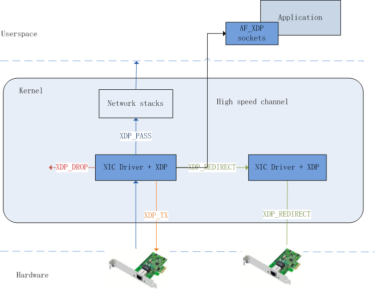

## eBPF和XDP学习-XDP深入

#### **1**.  XDP基础

###### 1.1 XDP主要Action

(1) XDP_PASS:
 Pass into normal network stack (could be modified)
(2) XDP_DROP:
 Very fast drop (recycle page in driver)
(3) XDP_TX:
Forward or TX-bounce back-out same interface
(4) XDP_REDIRECT:
Redirect ingress frames to other XDP enabled netdevs

#### 2.  整体架构如下




#### 3.主要参考


###### 3.1  XDP_PASS

https://github.com/xdp-project/xdp-tutorial/tree/master/basic01-xdp-pass

kernel:

```
/* SPDX-License-Identifier: GPL-2.0 */
#include <linux/bpf.h>
#include "bpf_helpers.h"

SEC("xdp")
int  xdp_prog_simple(struct xdp_md *ctx)
{
	return XDP_PASS;
}

char _license[] SEC("license") = "GPL";

```

###### 3.2 XDP_DROP

https://github.com/xdp-project/xdp-tutorial/tree/master/packet01-parsing

kernel:

```
SEC("xdp_packet_parser")
int  xdp_parser_func(struct xdp_md *ctx)
{
	void *data_end = (void *)(long)ctx->data_end;
	void *data = (void *)(long)ctx->data;
	struct ethhdr *eth;

	/* Default action XDP_PASS, imply everything we couldn't parse, or that
	 * we don't want to deal with, we just pass up the stack and let the
	 * kernel deal with it.
	 */
	__u32 action = XDP_PASS; /* Default action */

        /* These keep track of the next header type and iterator pointer */
	struct hdr_cursor nh;
	int nh_type;

	/* Start next header cursor position at data start */
	nh.pos = data;

	/* Packet parsing in steps: Get each header one at a time, aborting if
	 * parsing fails. Each helper function does sanity checking (is the
	 * header type in the packet correct?), and bounds checking.
	 */
	nh_type = parse_ethhdr(&nh, data_end, &eth);
	if (nh_type != bpf_htons(ETH_P_IPV6))
		goto out;

	/* Assignment additions go below here */

	action = XDP_DROP;
out:
	return xdp_stats_record_action(ctx, action); /* read via xdp_stats */
}
```


###### 3.3 XDP_TX

https://github.com/torvalds/linux/blob/master/samples/bpf/xdp2_kern.c

kernel：

```
SEC("xdp1")
int xdp_prog1(struct xdp_md *ctx)
{
	void *data_end = (void *)(long)ctx->data_end;
	void *data = (void *)(long)ctx->data;
	struct ethhdr *eth = data;
	int rc = XDP_DROP;
	long *value;
	u16 h_proto;
	u64 nh_off;
	u32 ipproto;

	nh_off = sizeof(*eth);
	if (data + nh_off > data_end)
		return rc;

	h_proto = eth->h_proto;

	if (h_proto == htons(ETH_P_8021Q) || h_proto == htons(ETH_P_8021AD)) {
		struct vlan_hdr *vhdr;

		vhdr = data + nh_off;
		nh_off += sizeof(struct vlan_hdr);
		if (data + nh_off > data_end)
			return rc;
		h_proto = vhdr->h_vlan_encapsulated_proto;
	}
	if (h_proto == htons(ETH_P_8021Q) || h_proto == htons(ETH_P_8021AD)) {
		struct vlan_hdr *vhdr;

		vhdr = data + nh_off;
		nh_off += sizeof(struct vlan_hdr);
		if (data + nh_off > data_end)
			return rc;
		h_proto = vhdr->h_vlan_encapsulated_proto;
	}

	if (h_proto == htons(ETH_P_IP))
		ipproto = parse_ipv4(data, nh_off, data_end);
	else if (h_proto == htons(ETH_P_IPV6))
		ipproto = parse_ipv6(data, nh_off, data_end);
	else
		ipproto = 0;

	value = bpf_map_lookup_elem(&rxcnt, &ipproto);
	if (value)
		*value += 1;

	if (ipproto == IPPROTO_UDP) {
		swap_src_dst_mac(data);
		rc = XDP_TX;
	}

	return rc;
}

```


###### 3.4 XDP_REDIRECT

https://github.com/xdp-project/xdp-tutorial/blob/master/packet03-redirecting/xdp_prog_kern.c

kernel:

```
SEC("xdp_redirect_map")
int xdp_redirect_map_func(struct xdp_md *ctx)
{
	void *data_end = (void *)(long)ctx->data_end;
	void *data = (void *)(long)ctx->data;
	struct hdr_cursor nh;
	struct ethhdr *eth;
	int eth_type;
	int action = XDP_PASS;
	unsigned char *dst;

	/* These keep track of the next header type and iterator pointer */
	nh.pos = data;

	/* Parse Ethernet and IP/IPv6 headers */
	eth_type = parse_ethhdr(&nh, data_end, &eth);
	if (eth_type == -1)
		goto out;

	/* Do we know where to redirect this packet? */
	dst = bpf_map_lookup_elem(&redirect_params, eth->h_source);
	if (!dst)
		goto out;

	/* Set a proper destination address */
	memcpy(eth->h_dest, dst, ETH_ALEN);
	action = bpf_redirect_map(&tx_port, 0, 0);

out:
	return xdp_stats_record_action(ctx, action);
}
```


https://github.com/torvalds/linux/blob/master/samples/bpf/xdp_redirect_kern.c

```
SEC("xdp_redirect")
int xdp_redirect_prog(struct xdp_md *ctx)
{
	void *data_end = (void *)(long)ctx->data_end;
	void *data = (void *)(long)ctx->data;
	struct ethhdr *eth = data;
	int rc = XDP_DROP;
	int *ifindex, port = 0;
	long *value;
	u32 key = 0;
	u64 nh_off;

	nh_off = sizeof(*eth);
	if (data + nh_off > data_end)
		return rc;

	ifindex = bpf_map_lookup_elem(&tx_port, &port);
	if (!ifindex)
		return rc;

	value = bpf_map_lookup_elem(&rxcnt, &key);
	if (value)
		*value += 1;

	swap_src_dst_mac(data);
	return bpf_redirect(*ifindex, 0);
}
```


###### 3.5 Tail Call

https://github.com/netoptimizer/prototype-kernel/blob/master/kernel/samples/bpf/bpf_tail_calls01_kern.c

kernel:

```
/* Main/root ebpf xdp program */
SEC("xdp")
int  xdp_prog(struct xdp_md *ctx)
{
	void *data_end = (void *)(long)ctx->data_end;
	void *data = (void *)(long)ctx->data;
	struct ethhdr *eth = data;

	bpf_debug("XDP: Killroy was here! %d\n", 42);

	/* Validate packet length is minimum Eth header size */
	if (eth + 1 > data_end)
		return XDP_ABORTED;

	bpf_tail_call(ctx, &jmp_table1, 1);

	/* bpf_tail_call on empty jmp_table entry, cause fall-through.
	 * (Normally a bpf_tail_call never returns)
	 */
	bpf_debug("XDP: jmp_table empty, reached fall-through action\n");
	return XDP_PASS;
}

/* Setup of jmp_table is (for now) done manually in _user.c.
 *
 * Notice: bpf_load.c have support for auto-populating for "socket/N",
 * "kprobe/N" and "kretprobe/N" (TODO: add support for "xdp/N").
 */

/* Tail call index=1 */
SEC("xdp_1")
int  xdp_tail_call_1(struct xdp_md *ctx)
{
	//void *data_end = (void *)(long)ctx->data_end;
	//void *data = (void *)(long)ctx->data;
	// struct ethhdr *eth = data;

	bpf_debug("XDP: tail call (xdp_1) id=1\n");

	bpf_tail_call(ctx, &jmp_table1, 5);

	return XDP_PASS;
}

/* Tail call index=5 */
SEC("xdp_5")
int  xdp_tail_call_2(struct xdp_md *ctx)
{
	//void *data_end = (void *)(long)ctx->data_end;
	//void *data = (void *)(long)ctx->data;
	//struct ethhdr *eth = data;
	volatile u32 hash = 0;

	// using experimental rx_hash feature
	//hash = ctx->rxhash;
	bpf_debug("XDP: tail call (xdp_5) id=5 hash=%u\n", hash);

//	bpf_tail_call(ctx, &jmp_table2, 0);
	return XDP_PASS;
}

SEC("xdp_unrelated")
int  xdp_some_tail_call_3(struct xdp_md *ctx)
{
	//void *data_end = (void *)(long)ctx->data_end;
	//void *data = (void *)(long)ctx->data;
	//struct ethhdr *eth = data;
	volatile u32 hash = 0;

	// using experimental rx_hash feature
	//hash = ctx->rxhash;
	bpf_debug("XDP: tail call 'xdp_unrelated' hash=%u\n", hash);

	//bpf_tail_call(ctx, &jmp_table1, 1); // Can give loop (capped runtime)

	bpf_tail_call(ctx, &jmp_table3, 0);
	bpf_tail_call(ctx, &jmp_table2, 0);
	return XDP_PASS;
}
```


#### 4. 资料参考

[eBPF 简史](https://www.ibm.com/developerworks/cn/linux/l-lo-eBPF-history/index.html)

[https://www.kernel.org/doc/Documentation/networking/filter.txt](https://www.kernel.org/doc/Documentation/networking/filter.txt)

[https://prototype-kernel.readthedocs.io/en/latest/](https://prototype-kernel.readthedocs.io/en/latest/)

https://prototype-kernel.readthedocs.io/en/latest/bpf/index.html

[http://vger.kernel.org/lpc_net2018_talks/XDP_meta-data_LPC_final_final.pdf](http://vger.kernel.org/lpc_net2018_talks/XDP_meta-data_LPC_final_final.pdf)


#### 5. 开源项目参考

[linux](https://www.kernel.org/)

[https://github.com/cilium/cilium](https://github.com/cilium/cilium)

[https://github.com/netoptimizer/prototype-kernel](https://github.com/netoptimizer/prototype-kernel)

[https://github.com/facebookincubator/katran](https://github.com/facebookincubator/katran)

[https://github.com/xdp-project/xdp-tutorial](https://github.com/xdp-project/xdp-tutorial)