# eBPF和XDP学习进阶-AF_XDP

#### 1. 概述

AF_XDP is an address family that is optimized for high performance packet processing.

Using the XDP_REDIRECT action from an XDP program, the program can redirect ingress frames to other XDP enabled netdevs, using the bpf_redirect_map() function. AF_XDP sockets enable the possibility for XDP programs to redirect frames to a memory buffer in a user-space application.

AF_XDP is for faster raw packet delivery to userspace.

- Unlike tcpdump, as it owns/steals the packet
  Might want to add a copy mode for XDP_PASS

- Hooking into XDP provides:
  Packet filter flexibility (avoid reinjecting into network stack)
  Fallback mode (with copying) on any driver supporting XDP_REDIRECT

- Performance tricks:
  Userspace preallocates memory, passes to kernel for NIC RX-rings
  NetChannel-like SPSC queues between kernel and userspace

  

#### 2. AF_XDP原理

###### 2.1  网络数据流图


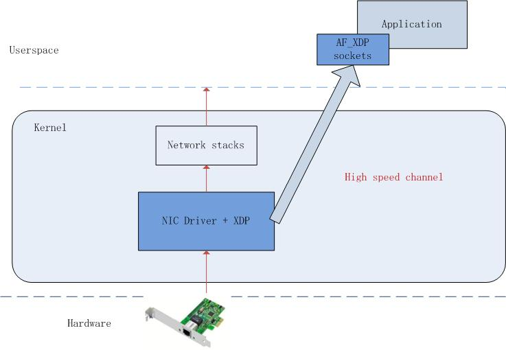


###### 2.2  TX、RX、Fill、Completion Rings

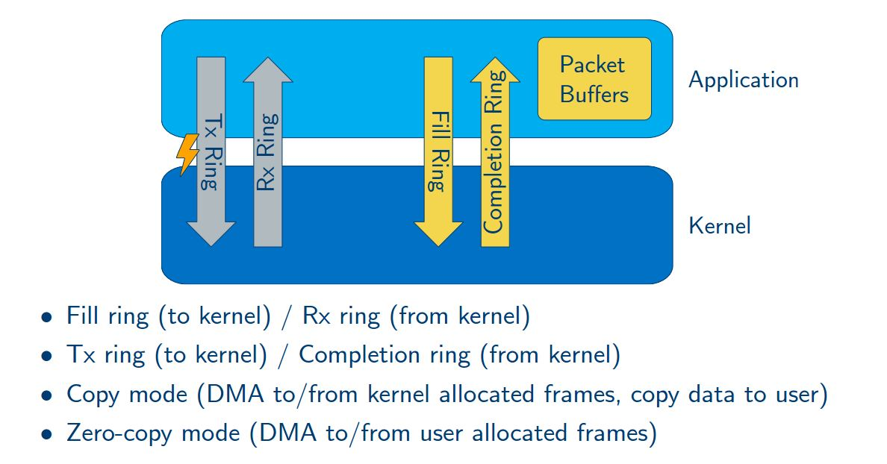

-  **Rings概述**

There are a four different kind of rings: Fill, Completion, RX and TX. All rings are single-producer/single-consumer, so the user-space application need explicit synchronization of multiple processes/threads are reading/writing to them.

The UMEM uses two rings: Fill and Completion. Each socket associated with the UMEM must have an RX queue, TX queue or both. Say, that there is a setup with four sockets (all doing TX and RX). Then there will be one Fill ring, one Completion ring, four TX rings and four RX rings.

The rings are head(producer)/tail(consumer) based rings. A producer writes the data ring at the index pointed out by struct xdp_ring producer member, and increasing the producer index. A consumer reads the data ring at the index pointed out by struct xdp_ring consumer member, and increasing the consumer index.

The rings are configured and created via the _RING setsockopt system calls and mmapped to user-space using the appropriate offset to mmap() (XDP_PGOFF_RX_RING, XDP_PGOFF_TX_RING, XDP_UMEM_PGOFF_FILL_RING and XDP_UMEM_PGOFF_COMPLETION_RING).

The size of the rings need to be of size power of two.

- **UMEM Fill Ring**

The Fill ring is used to transfer ownership of UMEM frames from user-space to kernel-space. The UMEM addrs are passed in the ring. As an example, if the UMEM is 64k and each chunk is 4k, then the UMEM has 16 chunks and can pass addrs between 0 and 64k.

Frames passed to the kernel are used for the ingress path (RX rings).

The user application produces UMEM addrs to this ring. Note that the kernel will mask the incoming addr. E.g. for a chunk size of 2k, the log2(2048) LSB of the addr will be masked off, meaning that 2048, 2050 and 3000 refers to the same chunk.

- **UMEM Completetion Ring**

The Completion Ring is used transfer ownership of UMEM frames from kernel-space to user-space. Just like the Fill ring, UMEM indicies are used.

Frames passed from the kernel to user-space are frames that has been sent (TX ring) and can be used by user-space again.

The user application consumes UMEM addrs from this ring.

- **RX Ring**

The RX ring is the receiving side of a socket. Each entry in the ring is a struct xdp_desc descriptor. The descriptor contains UMEM offset (addr) and the length of the data (len).

If no frames have been passed to kernel via the Fill ring, no descriptors will (or can) appear on the RX ring.

The user application consumes struct xdp_desc descriptors from this ring.

- **TX Ring**

The TX ring is used to send frames. The struct xdp_desc descriptor is filled (index, length and offset) and passed into the ring.

To start the transfer a sendmsg() system call is required. This might be relaxed in the future.

The user application produces struct xdp_desc descriptors to this ring.


###### 2.3 umem 和 rings


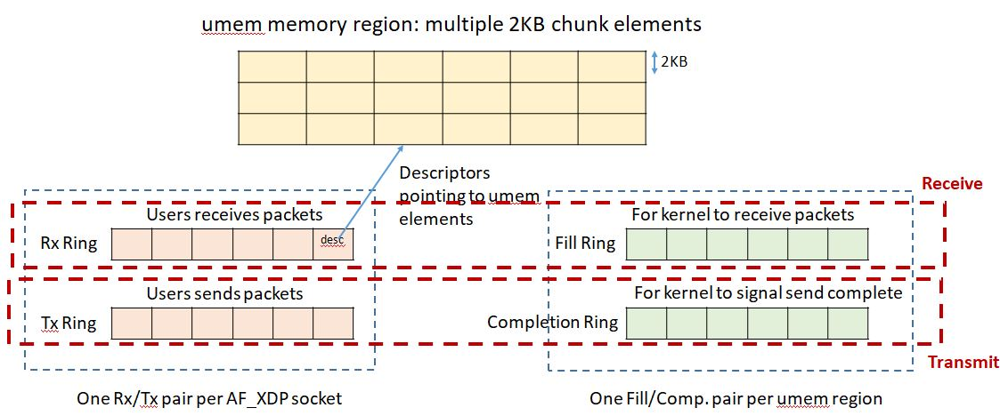


UMEM is a region of virtual contiguous memory, divided into equal-sized frames. An UMEM is associated to a netdev and a specific queue id of that netdev. It is created and configured (chunk size, headroom, start address and size) by using the XDP_UMEM_REG setsockopt system call. A UMEM is bound to a netdev and queue id, via the bind() system call.

An AF_XDP is socket linked to a single UMEM, but one UMEM can have multiple AF_XDP sockets. To share an UMEM created via one socket A, the next socket B can do this by setting the XDP_SHARED_UMEM flag in struct sockaddr_xdp member sxdp_flags, and passing the file descriptor of A to struct sockaddr_xdp member sxdp_shared_umem_fd.

The UMEM has two single-producer/single-consumer rings, that are used to transfer ownership of UMEM frames between the kernel and the user-space application.


**(0) Prepare for AF_XDP**

如下图示：初始umem的size是8。

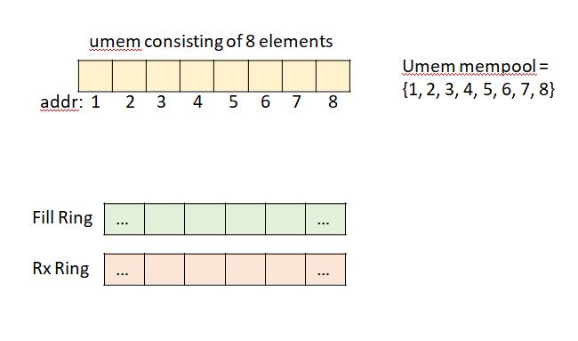

**(1) Receive Packet**

step1：


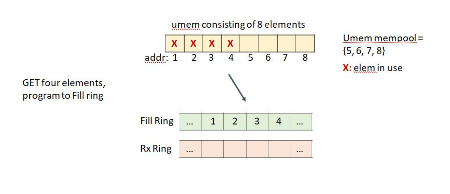


step2：

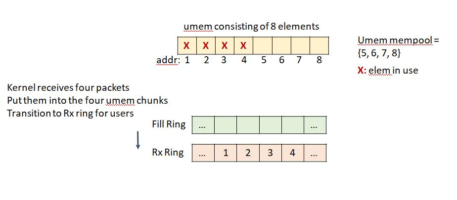


step3：


step4：

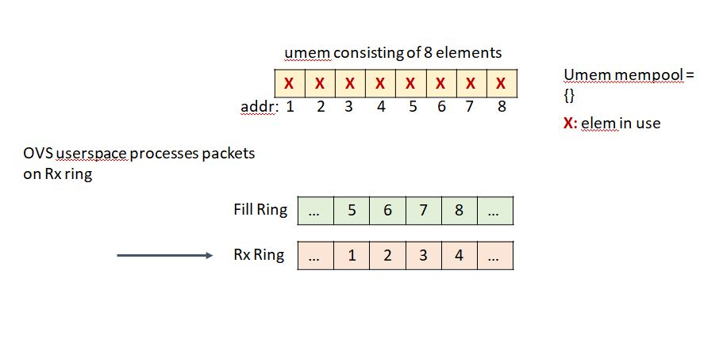

step5：

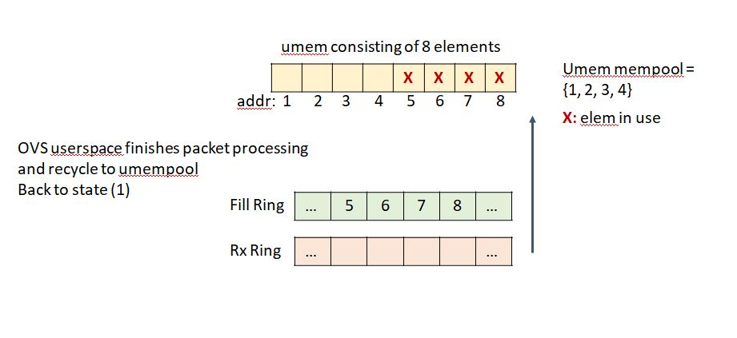


**(2) Send Packet**


step1：

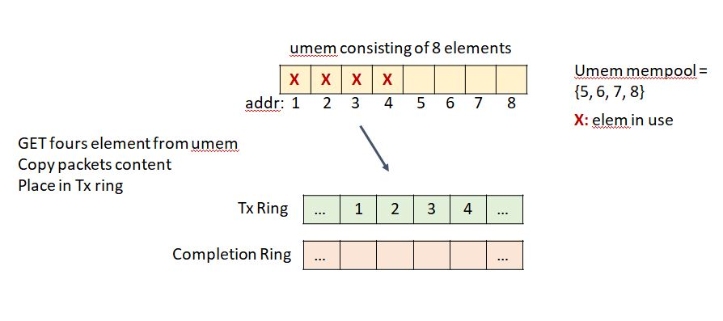

step2：

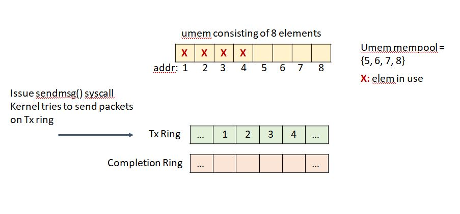

step3：


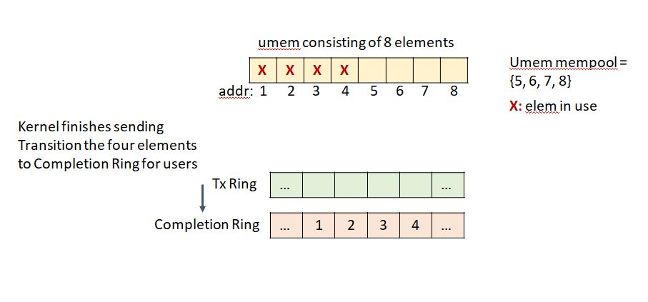step4:


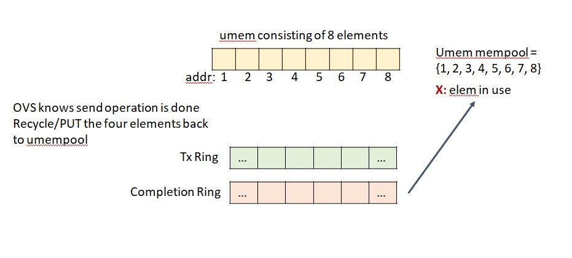

#### 2. AF_XDP开发

step1: configure

```
static struct xsk_umem_info *xsk_configure_umem(void *buffer, u64 size)
{
	struct xsk_umem_info *umem;
	struct xsk_umem_config cfg = {
		.fill_size = XSK_RING_PROD__DEFAULT_NUM_DESCS,
		.comp_size = XSK_RING_CONS__DEFAULT_NUM_DESCS,
		.frame_size = opt_xsk_frame_size,
		.frame_headroom = XSK_UMEM__DEFAULT_FRAME_HEADROOM,
	};
	int ret;

	umem = calloc(1, sizeof(*umem));
	if (!umem)
		exit_with_error(errno);

	ret = xsk_umem__create(&umem->umem, buffer, size, &umem->fq, &umem->cq,
			       &cfg);
	if (ret)
		exit_with_error(-ret);

	umem->buffer = buffer;
	return umem;
}


static struct xsk_socket_info *xsk_configure_socket(struct xsk_umem_info *umem)
{
	struct xsk_socket_config cfg;
	struct xsk_socket_info *xsk;
	int ret;
	u32 idx;
	int i;

	xsk = calloc(1, sizeof(*xsk));
	if (!xsk)
		exit_with_error(errno);

	xsk->umem = umem;
	cfg.rx_size = XSK_RING_CONS__DEFAULT_NUM_DESCS;
	cfg.tx_size = XSK_RING_PROD__DEFAULT_NUM_DESCS;
	cfg.libbpf_flags = 0;
	cfg.xdp_flags = opt_xdp_flags;
	cfg.bind_flags = opt_xdp_bind_flags;
	ret = xsk_socket__create(&xsk->xsk, opt_if, opt_queue, umem->umem,
				 &xsk->rx, &xsk->tx, &cfg);
	if (ret)
		exit_with_error(-ret);

	ret = bpf_get_link_xdp_id(opt_ifindex, &prog_id, opt_xdp_flags);
	if (ret)
		exit_with_error(-ret);

	ret = xsk_ring_prod__reserve(&xsk->umem->fq,
				     XSK_RING_PROD__DEFAULT_NUM_DESCS,
				     &idx);
	if (ret != XSK_RING_PROD__DEFAULT_NUM_DESCS)
		exit_with_error(-ret);
	for (i = 0; i < XSK_RING_PROD__DEFAULT_NUM_DESCS; i++)
		*xsk_ring_prod__fill_addr(&xsk->umem->fq, idx++) =
			i * opt_xsk_frame_size;
	xsk_ring_prod__submit(&xsk->umem->fq,
			      XSK_RING_PROD__DEFAULT_NUM_DESCS);

	return xsk;
}
```

step2: actions

l2fwd

```
static void l2fwd(struct xsk_socket_info *xsk)
{
	for (;;) {
		unsigned int rcvd, i;
		u32 idx_rx = 0, idx_tx = 0;
		int ret;

		for (;;) {
			complete_tx_l2fwd(xsk);

			rcvd = xsk_ring_cons__peek(&xsk->rx, BATCH_SIZE,
						   &idx_rx);
			if (rcvd > 0)
				break;
		}

		ret = xsk_ring_prod__reserve(&xsk->tx, rcvd, &idx_tx);
		while (ret != rcvd) {
			if (ret < 0)
				exit_with_error(-ret);
			ret = xsk_ring_prod__reserve(&xsk->tx, rcvd, &idx_tx);
		}

		for (i = 0; i < rcvd; i++) {
			u64 addr = xsk_ring_cons__rx_desc(&xsk->rx,
							  idx_rx)->addr;
			u32 len = xsk_ring_cons__rx_desc(&xsk->rx,
							 idx_rx++)->len;
			char *pkt = xsk_umem__get_data(xsk->umem->buffer, addr);

			swap_mac_addresses(pkt);

			hex_dump(pkt, len, addr);
			xsk_ring_prod__tx_desc(&xsk->tx, idx_tx)->addr = addr;
			xsk_ring_prod__tx_desc(&xsk->tx, idx_tx++)->len = len;
		}

		xsk_ring_prod__submit(&xsk->tx, rcvd);
		xsk_ring_cons__release(&xsk->rx, rcvd);

		xsk->rx_npkts += rcvd;
		xsk->outstanding_tx += rcvd;
	}
}

static inline void complete_tx_l2fwd(struct xsk_socket_info *xsk)
{
	u32 idx_cq = 0, idx_fq = 0;
	unsigned int rcvd;
	size_t ndescs;

	if (!xsk->outstanding_tx)
		return;

	kick_tx(xsk);
	ndescs = (xsk->outstanding_tx > BATCH_SIZE) ? BATCH_SIZE :
		xsk->outstanding_tx;

	/* re-add completed Tx buffers */
	rcvd = xsk_ring_cons__peek(&xsk->umem->cq, ndescs, &idx_cq);
	if (rcvd > 0) {
		unsigned int i;
		int ret;

		ret = xsk_ring_prod__reserve(&xsk->umem->fq, rcvd, &idx_fq);
		while (ret != rcvd) {
			if (ret < 0)
				exit_with_error(-ret);
			ret = xsk_ring_prod__reserve(&xsk->umem->fq, rcvd,
						     &idx_fq);
		}
		for (i = 0; i < rcvd; i++)
			*xsk_ring_prod__fill_addr(&xsk->umem->fq, idx_fq++) =
				*xsk_ring_cons__comp_addr(&xsk->umem->cq,
							  idx_cq++);

		xsk_ring_prod__submit(&xsk->umem->fq, rcvd);
		xsk_ring_cons__release(&xsk->umem->cq, rcvd);
		xsk->outstanding_tx -= rcvd;
		xsk->tx_npkts += rcvd;
	}
}
```


txonly:

```
static void tx_only(struct xsk_socket_info *xsk)
{
	int timeout, ret, nfds = 1;
	struct pollfd fds[nfds + 1];
	u32 idx, frame_nb = 0;

	memset(fds, 0, sizeof(fds));
	fds[0].fd = xsk_socket__fd(xsk->xsk);
	fds[0].events = POLLOUT;
	timeout = 1000; /* 1sn */

	for (;;) {
		if (opt_poll) {
			ret = poll(fds, nfds, timeout);
			if (ret <= 0)
				continue;

			if (!(fds[0].revents & POLLOUT))
				continue;
		}

		if (xsk_ring_prod__reserve(&xsk->tx, BATCH_SIZE, &idx) ==
		    BATCH_SIZE) {
			unsigned int i;

			for (i = 0; i < BATCH_SIZE; i++) {
				xsk_ring_prod__tx_desc(&xsk->tx, idx + i)->addr
					= (frame_nb + i) * opt_xsk_frame_size;
				xsk_ring_prod__tx_desc(&xsk->tx, idx + i)->len =
					sizeof(pkt_data) - 1;
			}

			xsk_ring_prod__submit(&xsk->tx, BATCH_SIZE);
			xsk->outstanding_tx += BATCH_SIZE;
			frame_nb += BATCH_SIZE;
			frame_nb %= NUM_FRAMES;
		}

		complete_tx_only(xsk);
	}
}

static inline void complete_tx_only(struct xsk_socket_info *xsk)
{
	unsigned int rcvd;
	u32 idx;

	if (!xsk->outstanding_tx)
		return;

	kick_tx(xsk);

	rcvd = xsk_ring_cons__peek(&xsk->umem->cq, BATCH_SIZE, &idx);
	if (rcvd > 0) {
		xsk_ring_cons__release(&xsk->umem->cq, rcvd);
		xsk->outstanding_tx -= rcvd;
		xsk->tx_npkts += rcvd;
	}
}
```


rx_drop_all

```
static void rx_drop_all(void)
{
	struct pollfd fds[MAX_SOCKS + 1];
	int i, ret, timeout, nfds = 1;

	memset(fds, 0, sizeof(fds));

	for (i = 0; i < num_socks; i++) {
		fds[i].fd = xsk_socket__fd(xsks[i]->xsk);
		fds[i].events = POLLIN;
		timeout = 1000; /* 1sn */
	}

	for (;;) {
		if (opt_poll) {
			ret = poll(fds, nfds, timeout);
			if (ret <= 0)
				continue;
		}

		for (i = 0; i < num_socks; i++)
			rx_drop(xsks[i]);
	}
}


static void rx_drop(struct xsk_socket_info *xsk)
{
	unsigned int rcvd, i;
	u32 idx_rx = 0, idx_fq = 0;
	int ret;

	rcvd = xsk_ring_cons__peek(&xsk->rx, BATCH_SIZE, &idx_rx);
	if (!rcvd)
		return;

	ret = xsk_ring_prod__reserve(&xsk->umem->fq, rcvd, &idx_fq);
	while (ret != rcvd) {
		if (ret < 0)
			exit_with_error(-ret);
		ret = xsk_ring_prod__reserve(&xsk->umem->fq, rcvd, &idx_fq);
	}

	for (i = 0; i < rcvd; i++) {
		u64 addr = xsk_ring_cons__rx_desc(&xsk->rx, idx_rx)->addr;
		u32 len = xsk_ring_cons__rx_desc(&xsk->rx, idx_rx++)->len;
		char *pkt = xsk_umem__get_data(xsk->umem->buffer, addr);

		hex_dump(pkt, len, addr);
		*xsk_ring_prod__fill_addr(&xsk->umem->fq, idx_fq++) = addr;
	}

	xsk_ring_prod__submit(&xsk->umem->fq, rcvd);
	xsk_ring_cons__release(&xsk->rx, rcvd);
	xsk->rx_npkts += rcvd;
}
```


#### 3. 参考：

 Introducing AF_XDP support             https://lwn.net/Articles/750293/

 Accelerating networking with AF_XDP      https://lwn.net/Articles/750845/

http://vger.kernel.org/lpc_net2018_talks/lpc18_pres_af_xdp_perf-v3.pdf

http://vger.kernel.org/lpc_net2018_talks/lpc18_paper_af_xdp_perf-v2.pdf

https://www.slidestalk.com/u10024/The_Path_to_DPDK_Speeds_for_AF_XDP?video

http://vger.kernel.org/lpc_net2018_talks/ovs-ebpf-afxdp.pdf

http://vger.kernel.org/lpc_net2018_talks/ovs-ebpf-lpc18-presentation.pdf

https://ovsfall2018.sched.com/event/IO7p/fast-userspace-ovs-with-afxdp

https://www.kernel.org/doc/html/v4.18/networking/af_xdp.html